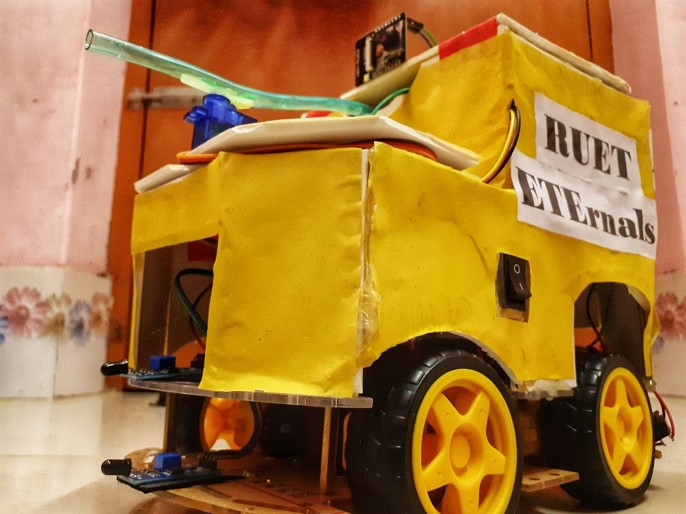

# Smart Fire-Fighter Robot (ASPHYXIATOR18) 🚒🤖

An innovative robot designed to tackle fires in hazardous areas, minimizing risk for firefighters. Using sensors and remote control, this robot detects and extinguishes fires automatically, making it a smart, efficient solution for emergencies.

## 🔧 Key Features
- **Bluetooth-Controlled** via smartphone 📱
- **Flame Detection** using IR sensors 🔥
- **Automatic Water Spraying** with a DC pump 💧
- **Remote Surveillance** with optional camera integration 🎥

## 🛠 Components
- Arduino Uno, Flame Sensor, HC-05 Bluetooth Module, DC Water Pump, ESP32 CAM, Servo Motor, and more.

## 🚀 How It Works
1. **Detect Fire** using sensors.
2. **Move Towards Fire** with motor-driven wheels.
3. **Extinguish Fire** by activating the water pump.
4. **Surveillance** with camera module (optional).

## 🖼 Visuals

## 🏢 Applications
- **Firefighting in confined spaces**: Useful in areas where human access is limited or risky.
- **Industrial and home use**: Can be deployed in homes, labs, offices, or industrial settings to detect and extinguish fires.
- **Surveillance**: Assists in finding injured individuals or spotting hidden fires using an optional camera.

## 🔮 Future Scope
- **Automation with AI**: Incorporating AI for autonomous operation without manual control.
- **Enhanced Fire Detection**: Integration of advanced techniques like thermal imaging.
- **Remote Surveillance**: Use of sophisticated cameras for real-time monitoring.

## 🔚 Conclusion
The **Smart Fire-Fighter Robot** has the potential to save lives and property by reducing the risks associated with fire emergencies. With further development, this prototype can be adapted for real-world use and become a vital tool for firefighters globally.

## 👥 Team Members
- **Md. Minhazul Islam** - Dept. of ETE, RUET
- **Sk Abdul Kaium** - Dept. of ETE, RUET
- **Farzana Akter** - Lecturer, Dept. of ETE, RUET

## 📂 Full Presentation
Check out the complete project presentation [here](https://github.com/Miinhaz/Smart-Fire-Fighter-Robot/blob/main/CSE%20FEST%202K22.pptx).

